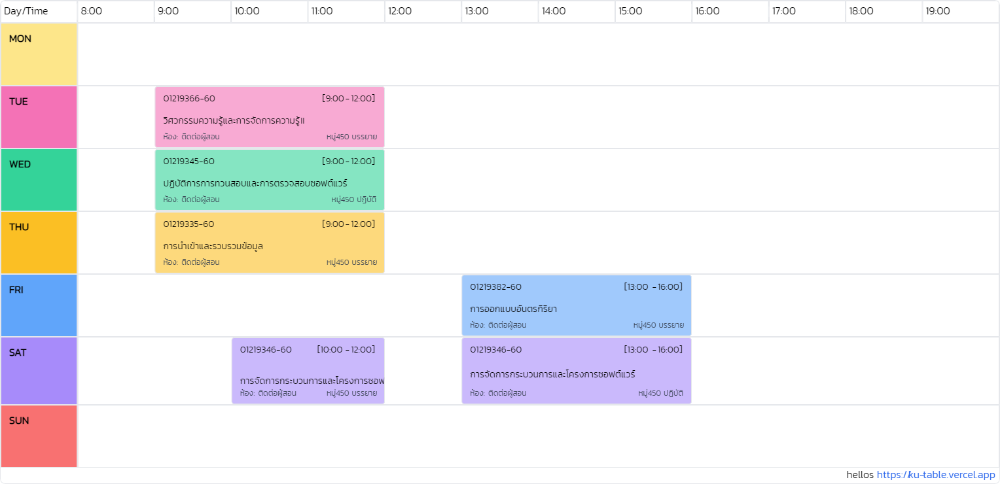

# KU-TABLE
ตารางเรียนที่อยากได้จากเว็บ KU<br>
เซฟตารางไปใช้ได้เลยครับ 🤝🏻


https://ku-table.vercel.app

## Example PNG Table



[](https://ku-table.vercel.app)
[](https://GitHub.com/Noboomta/schedule-ku/contributors/)
[](http://makeapullrequest.com)

[](https://GitHub.com/Noboomta/schedule-ku/issues/)
[](https://GitHub.com/Noboomta/schedule-ku/issues?q=is%3Aissue+is%3Aclosed)
[](https://GitHub.com/Noboomta/schedule-ku/pull/)
[](https://GitHub.com/Noboomta/schedule-ku/pull/)

[](https://github.com/paralect/docker-compose-starter/watchers)
[](https://github.com/auxilincom/docker-compose-starter/stargazers)

### หมายเหตุ
ทาง dev ไม่มีการเก็บค่า username password และไม่มีตังจ่ายค่า server database<br>
มีเพียงการนับจำนวนคนใช้งานผ่านการเก็บ cache stdId มีการ log ชั้นปีและคณะของผู้ใช้งานเพื่อทราบกลุ่มผู้ใช้<br>
ตรวจสอบโค้ดได้ที่ https://github.com/Noboomta/KU-Table-server <br>
จุดประสงค์ของ dev อยากให้มี ตารางเรียน บนหน้าเว็บของมหาลัย ไม่ได้มีเจตนาหาผลประโยชน์ใดๆจากผู้ใช้<br>
ทาง dev ยินดีให้โค้ดทั้งหมดแก่มหาลัยเพียงทำตาม <strong>Getting started with this app.</strong><br>

### ที่มาข้อมูล
https://www.ku.ac.th/th/bachelor-degree <br>
https://registrar.ku.ac.th/wp-content/uploads/2017/05/%E0%B8%81%E0%B8%B2%E0%B8%A3%E0%B8%9B%E0%B8%A3%E0%B8%B1%E0%B8%9A%E0%B8%9B%E0%B8%A3%E0%B8%B8%E0%B8%87%E0%B8%AB%E0%B8%A1%E0%B8%A7%E0%B8%94%E0%B8%A7%E0%B8%B4%E0%B8%8A%E0%B8%B2%E0%B8%A8%E0%B8%B6%E0%B8%81%E0%B8%A9%E0%B8%B2%E0%B8%97%E0%B8%B1%E0%B9%88%E0%B8%A7%E0%B9%84%E0%B8%9B-2564-%E0%B8%AA%E0%B8%A0%E0%B8%B2-%E0%B8%A1%E0%B8%81.-%E0%B8%AD.pdf <br>
https://github.com/marsDev31/KUnit

## Getting started with this app.

Clone this repository

```zsh
git clone https://github.com/Noboomta/Ku-table.git
```

Install dependencies using `yarn`

if you don't have `yarn`. Please install it first by

```zsh
npm install --global yarn
# or
brew install yarn
```

install project's dependencies

```zsh
yarn
```

after this step, you will get `node_modules` folder in the root of the project.

add `.env` file

```
VUE_APP_BASE_SERVER_URL=https://<your-server-domain>
```

### Compiles and hot-reloads for development
```
yarn serve
```
the applciation will run at [localhost:8080](http://localhost:8080)

### Compiles and minifies for production
```
yarn build
```

### Lints and fixes files
```
yarn lint
```

### Customize configuration
See [Configuration Reference](https://cli.vuejs.org/config/).
